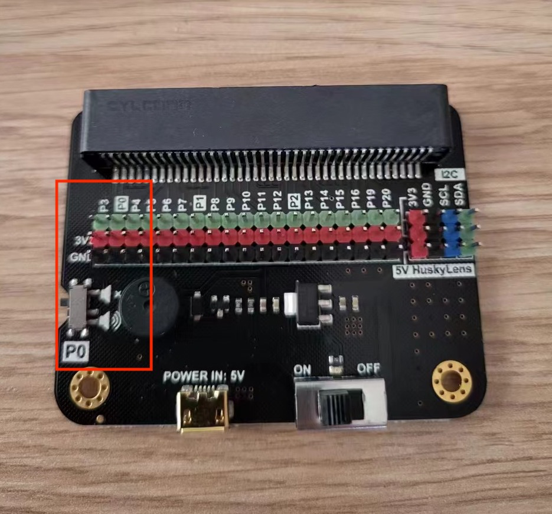
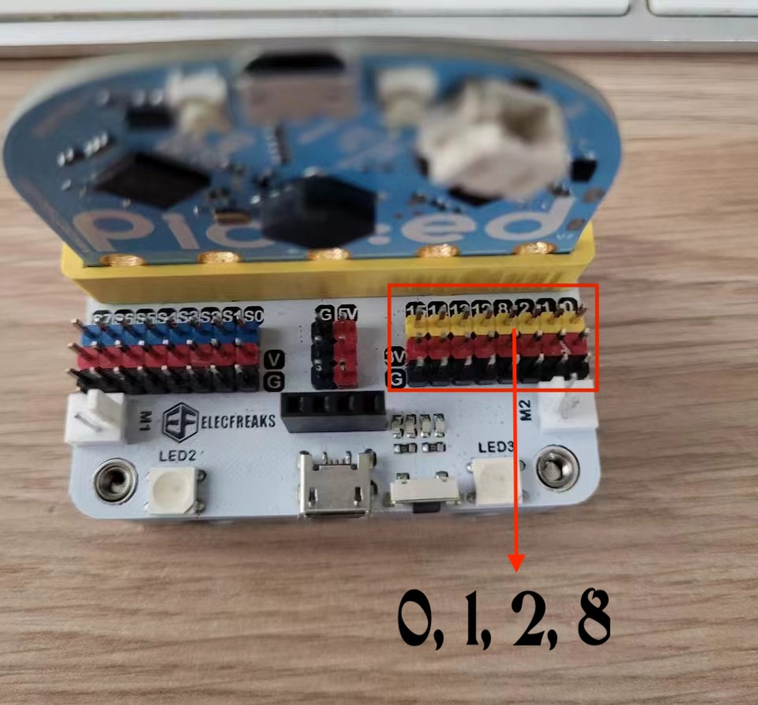
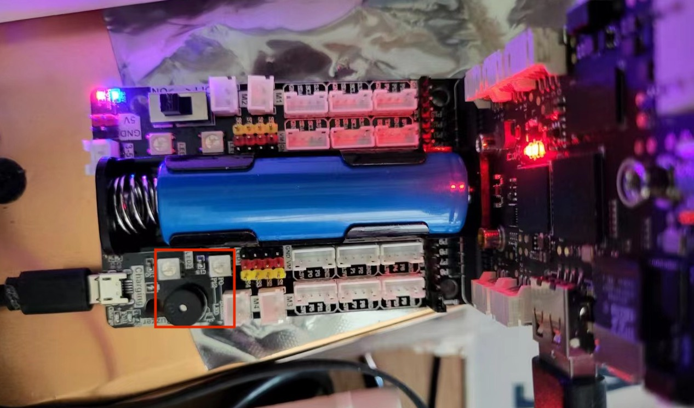
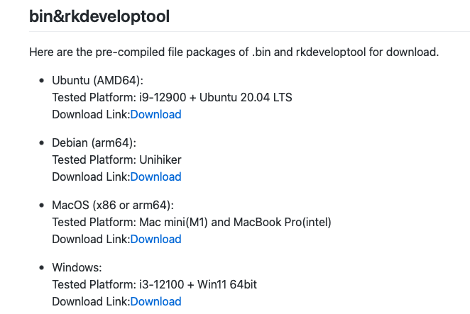

# Issues with Unihiker


## DOCUMENTATION

### I2C
I2C is not documented. There's [this section](https://www.unihiker.com/wiki/pinpong_python_lib#|-%20I2C%20Digital%20Wattmeter) but it doesn't really explain anything.

We need a summary of the functions:

```
>>> i2c.
i2c.board            i2c.readfrom(                           i2c.scan(
i2c.bus_num          i2c.readfrom_mem(                       i2c.writeto(
i2c.obj              i2c.readfrom_mem_restart_transmission(  i2c.writeto_mem()
```

I have started a small tutorial, we probably can use this and augment it.

### SPI

Same goes for SPI. There is a little bit of code, but (a) it's wrong, and (b) not enough.

```python
import time
from unihiker.board import Board, Pin, SPI

Board("UNIHIKER").begin()  # Initialize the UNIHIKER board. Select the board type, if not specified, it will be automatically detected.

# 0 represents SPI0 (P1 SCK, P10 MISO, P2 MOSI), 1 represents SPI1 (P13 SCK, P14 MISO, P15 MOSI)
# cs is the chip select pin, can only be used as master
spi0 = SPI(0, cs=Pin.P3)
```

In that code, `from unihiker.board import Board, Pin, SPI` will fail. It should be `from pinpong.board import Board, Pin, SPI`. And again we should document all the functions. But there's another issue first:

```python
>>> spi0 = SPI(0, cs=Pin.P3)
Traceback (most recent call last):
  File "<stdin>", line 1, in <module>
  File "/usr/local/lib/python3.7/dist-packages/pinpong/board.py", line 665, in __init__
    self.board.spi[bus_num][device_num] = eval(self.board.res["spi"]["class"]+"(bus_num, device_num)")
  File "<string>", line 1, in <module>
TypeError: __init__() missing 1 required positional argument: 'cs'
```

Even though I set the `cs` argument, it is not taken into account.

Also:

```
# 0 represents SPI0 (P1 SCK, P10 MISO, P2 MOSI), 1 represents SPI1 (P13 SCK, P14 MISO, P15 MOSI)
```

AH?

```python
>>> spi0 = SPI(1, cs=Pin.P3)
Traceback (most recent call last):
  File "<stdin>", line 1, in <module>
  File "/usr/local/lib/python3.7/dist-packages/pinpong/board.py", line 664, in __init__
    raise ValueError("spi does not support this device", spi_num, "List of supported spi devices",self.board.res["spi"]["busnum"])
ValueError: ('spi does not support this device', (1, 1), 'List of supported spi devices', [(0, 0)])
```

### UART

This is also a big annoyance, for 2 reasons.

1. The pins are not customizable. I know not all pins can be used for UART, but we should have a few available. And maybe, too, the possibility to create more than one UART.

2. Currently UART0 is P0/P3. Sure. EXCEPT THAT:

* `P0` is often used on Micro:bit baseboards (including some of your baseboards) for the buzzer. OOPS.
* `P3` is often not exposed on Micro:bit baseboards (including some of your baseboards). OOPS again. :-)

I have three Micro:board baseboards. One by DFRobot, one by Elecfreaks, and one by a random company, Yahboom.





With the 2 baseboards that have `P3`, I couldn't get UART to work because `P0` is the buzzer. And on the Elecfreaks, I can't get to `P3` anyway...

So we should have a way to customize the UART pins. And ideally, we should have a Micro:bit baseboard "Made for Unihiker". Like the Yahboom above, with UART, I2C, SPI ports. Note the addition of a 18650 battery slot, which is very useful.

### Side note about the 18650

An interesting fact: the Yahboom baseboard can power the Unihiker, but ONLY after it has started up.

* I plug in the Unihiker, and turn on the Micro:bit base. Nothing happens.
* I plug in the USB-C cable into the Unihiker: boot.
* I remove the USB-C cable once it has booted: no issues, it keeps going. Although the USB port is not powered anymore.

Maybe this should be documented too.

### Libraries

To my, ahhhhhh, surprise, I found that there are a LOT of libraries included.

```bash
root@unihiker:~/Tests# libs
/usr/local/lib/python3.7/dist-packages/pinpong/libs/
TLC_10bit_adc.py          dfrobot_ccs811.py           dfrobot_lis2dw12.py     dfrobot_sen0482.py          dfrobot_urm37.py
__init__.py               dfrobot_dht20.py            dfrobot_maqueen_plus.py dfrobot_sen0483.py          dfrobot_veml6075.py
__pycache__               dfrobot_dri0050.py          dfrobot_max17043.py     dfrobot_sen0492.py          dfrobot_veml7700.py
dfrobot_ads1115.py        dfrobot_ds0469.py           dfrobot_max30102.py     dfrobot_sgp40.py            dfrobot_vl53l0.py
dfrobot_aht20.py          dfrobot_ds1307.py           dfrobot_mcp4725.py      dfrobot_sht31.py            dfrobot_wind_direction.py
dfrobot_analog_urm09.py   dfrobot_dualuse_shield.py   dfrobot_mics.py         dfrobot_sht3x.py            dfrobot_wind_speed.py
dfrobot_as7341.py         dfrobot_ens160.py           dfrobot_mlx90614.py     dfrobot_shtc3.py            dfrobot_zz_io404d.py
dfrobot_asr.py            dfrobot_gravity_pm25.py     dfrobot_motor.py        dfrobot_speech_synthesis.py framebuf.py
dfrobot_audio_analyzer.py dfrobot_heartrate.py        dfrobot_mp3.py          dfrobot_ssd1306.py          kamoer_4460.py
dfrobot_bme280.py         dfrobot_huskylens.py        dfrobot_mpu6050.py      dfrobot_st7789.py           lcd1602.py
dfrobot_bme680.py         dfrobot_hx711.py            dfrobot_obloq.py        dfrobot_tcs34725.py         libs.json
dfrobot_bmi160.py         dfrobot_id809.py            dfrobot_ozone.py        dfrobot_tds.py              microbit_motor.py
dfrobot_bmm150.py         dfrobot_ili9341.py          dfrobot_paj7620u2.py    dfrobot_tm1650.py           pca_9685.py
dfrobot_bmp280.py         dfrobot_ina219.py           dfrobot_ph.py           dfrobot_uarttoi2c.py          rs485winddirection_rs485touart_uarttoi2c.py
dfrobot_bmp388.py         dfrobot_ina219_education.py dfrobot_pn532.py        dfrobot_ui.py              rs485windspeed_rs485touart_uarttoi2c.py
dfrobot_bmp3xx.py         dfrobot_lis.py              dfrobot_rgb1602.py      dfrobot_urm09.py            xy_md02.py
dfrobot_bno055.py         dfrobot_lis2dh.py           dfrobot_rgb_panel.py    dfrobot_urm12.py
```

And there's a `libs.json` file. Ohhh, what could be in there?


```json
{
"BOARD":
{
    "import":"from pinpong.board import Board",
    "api":"Board(boardname, port)\n  @boardname motherboard  name, currently supported uno leonardo mega2560 microbit\n  @port Serial port name, do not fill in the system wi
ll automatically select the appropriate port\nget_i2c_master(bus_num) : Get the I2C host controller\n  @bus_num I2C host controller number"
},

"PIN":
{
    "import":"from pinpong.board import Board,Pin",
    "api":"Pin(board, pin, mode)\n  @board A motherboard constructed using the Board class\n  @pin   Pin.D0-Pin.Dx or Pin.A0-Pin.Ax\n  @mode  Pin.IN Pin.OUT Pin.PULL_UP Pin.
PULL_DOWN\nvalue(v): Set or read the pin level\n  @v: 0 Output low level, 1 Output high level\n Pass no value:  Read pin level in input mode\non(): Output high level\noff(): Out
put low level\nirq(trigger, handler):Set the pin to interrupt mode\n  @trigger IRQ_RISING: Rising edge trigger. IRQ_FALLING: Falling edge trigger.\n  @handler Callback function 
after the interrupt is triggered"
},

"SERVO":
{
    "import":"from pinpong.board import Board,Pin\nfrom pinpong.libs.servo import Servo",
    "api":"Servo(board, pin_obj)\n  @board  A motherboard constructed using the Board class\n  @pin_obj   An object constructed using the Pin class, The servo is connected t
o the pin\nangle(value): Steering gear rotation Angle\n  @value Steering gear rotation Angle, range(0-180)\n"
},

"LCD1602_I2C":
{
    "import":"from pinpong.board import Board\nfrom pinpong.libs.lcd1602 import LCD1602_I2C",
    "api":"LCD1602_I2C(board, i2c_addr)\n  @board A motherboard constructed using the Board class\n  @i2c_addr   The i2c address of the LCD1602\nclear(): Clear screen\nbackl
ight(on): Turn: on and off the backlight\n  @on True: Turn on the backlight  False: Turn off the backlight\ndisplay(on):   On/off display\n  @on True: Open display  False: Turn 
off display\nset_cursor(x, y): Sets the cursor position\n  @x The x-coordinate of the cursor\n  @y The y-coordinate of the cursor\nprint(s): Display content on the LCD1602\n  @s
 Display content, can be a string, numbers, and other formats\nscroll_left():Scroll left one character width\nscroll_right():Scroll to the right one character width"
},

"MLX90614":
{
    "import":"from pinpong.board import Board\nfrom pinpong.libs.dfrobot_mlx90614 import MLX90614",
    "api":"MLX90614(board, i2c_addr)\n  @board A motherboard constructed using the Board class\n  @i2c_addr   The i2c address of the sensor, if not passed, defaults to 0x5A\
nobj_temp_c(): Gets the target temperature in degrees Celsius\nenv_temp_c(): Gets the ambient temperature in degrees Celsius\nobj_temp_f(): Gets the target temperature in degree
s Fahrenheit\nenv_temp_f(): Gets the ambient temperature in degrees Fahrenheit"
},
```
My my my, some kind of documentation! So sad we didn't have that in the documentation! :-)

These libraries represent possibly the most important part of the Unihiker ecosystem. They SHOULD be heavily publicized, not hidden!

### brightness

There is a `brightness xx` command in the Linux subsystem, but it was hard to find – it should be more obvious. And there should be a `GUI.brightness()` command to go with it. Using `os.system("brightness xx")` is a bit insecure.

## rkdeveloptool

```bash
> ./rkdeveloptool 
zsh: exec format error: ./rkdeveloptool
> file rkdeveloptool
rkdeveloptool: ELF 64-bit LSB pie executable, x86-64, version 1 (SYSV), dynamically linked, interpreter /lib64/ld-linux-x86-64.so.2, BuildID[sha1]=67559ea3e573e54277cea0f4041c3dacd465beab, for GNU/Linux 3.2.0, with debug_info, not stripped
> uname -a
Darwin dda 20.6.0 Darwin Kernel Version 20.6.0: Tue Oct 12 18:33:42 PDT 2021; root:xnu-7195.141.8~1/RELEASE_X86_64 x86_64
```

The link to the Mac OSX version of `rkdeveloptool` is in fact a Linux version.



[Ref](https://www.unihiker.com/wiki/burner_command_line)

As for the `burner.sh` bash script, it reads, 4 times `rkdeveloptool`, but should read `./rkdeveloptool`... 

```bash
#!/bin/bash
echo 'start'
echo 'device list:'
rkdeveloptool ld
echo '---'
echo 'burner loader...'
rkdeveloptool db rk3308_bs_loader_uart0_m0_emmc_port_support_sd_20220516.bin
sleep 3
echo 'burner img...'
rkdeveloptool wl 0 *.img
echo 'burner done'
sleep 3
echo 'reset device'
rkdeveloptool rd
```
vs

```bash
#!/bin/bash
echo 'start'
echo 'device list:'
./rkdeveloptool ld
echo '---'
echo 'burner loader...'
./rkdeveloptool db rk3308_bs_loader_uart0_m0_emmc_port_support_sd_20220516.bin
sleep 3
echo 'burner img...'
./rkdeveloptool wl 0 *.img
echo 'burner done'
sleep 3
echo 'reset device'
./rkdeveloptool rd
```

## Connectors and cables

### 4-pin connectors (I2C)
The pinout is kind of weird (not as weird as the Yahboom base though...), and considering the Grove ecosystem, maybe it'd be easier if at least one of the I2C connectors was Grove. Good show though on having TWO I2C connectors, this is helpful.

### Cables

Oh my dear friends, who is the person who thought that having 4-pin cables ALL WHITE was a good idea...? I have other DFRobot cables, in 3/4 different colors. All white makes it very hard to connect. And, in light of the GROVE proposal, make it black, red, yellow, white (GND, Vcc, SDA, SCL for I2C).

That's about it for now. I will probably have more later.