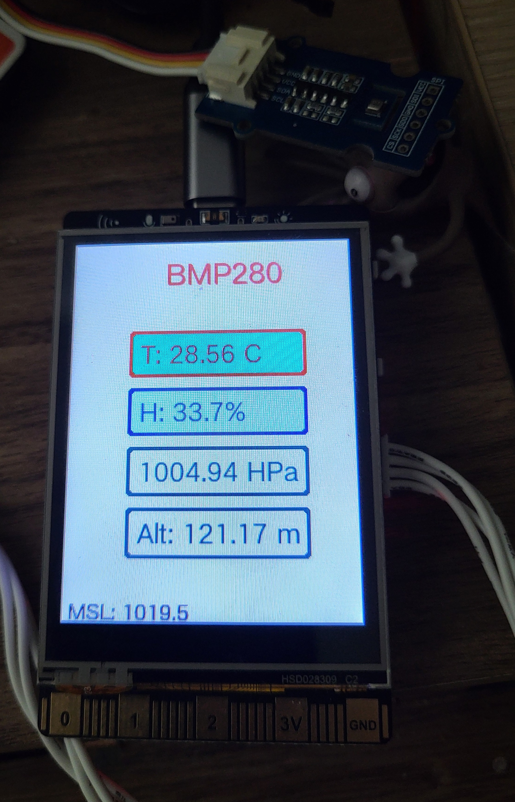
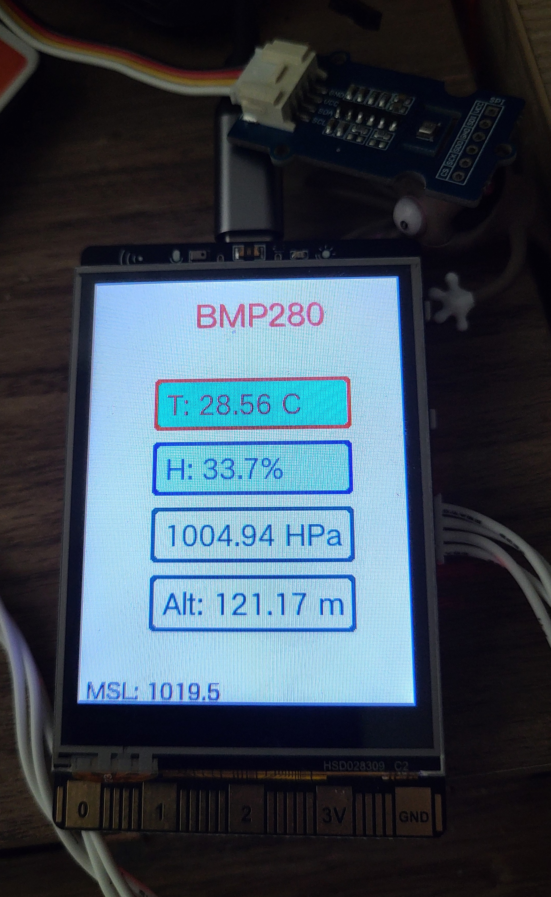

# Unihiker_Code

I have received from DFRobot a [Unihiker](https://www.unihiker.com/). So I am trying to help out by writing code, pointing out omissions in the docs, etc... This small repository hosts everything I will write about the Unihiker.

## Startup

### Network
The first startup went alright, albeit for one issue: my Macs are not able to connect to the Unihiker via ethernet over USB. So instead of trying to figure this out, I did the next best thing. I went to menu 5, Hotspot, clicked on `Hotspot: disabled` to turn it on, and connected to that network.


In `Network Settings`, my mown Wifi appeared after a while. I connected to that and reconnected to my network. After that, all good. I was able to ssh into the Unihiker.

Login is `root/dfrobot`. It's probably safer to change the password to something else, especially if you are going to use the Unihiker in the wild. Use the `passwd` command.

### OS update
I was able to update the OS with `apt update` and `apt upgrade` without issues. A friend mentioned that doing this, a few months ago, broke stuff. So far so good for me.

### VNC
There's a VNC server. Which I don't need. `sudo apt purge tigervnc-scraping-server` did the trick. After a reboot, it's gone. This is not a very powerful computer. Unless you really need VNC (why?), getting rid of useless stuff is a good idea.

### Documentation
It is nowhere near where it should be, especially a few months after launch, but it's [there](https://www.unihiker.com/wiki/), at least. One example. The docs, right at the beginning, say:

> With built-in co-processor, it is able to communicate with various analog/digital/I2C/UART/SPI sensors and acuators[sic].

There are two issues with this.

1. In the [Pinpong Python Lib](https://www.unihiker.com/wiki/pinpong_python_lib), UART and SPI are more or less well documented. It is a pity that UART, especially, cannot be assigned to other pins, but anyway. On the other hand, I2C is not documented. AT ALL. Why? No idea... I suspect, as usual, that the engineers were allowed to write the docs (and they really shouldn't), and couldn't be bothered. Something along the lines of *You can figure it out!* Sigh...

2. A lot of sensor libraries are provided – with ZERO documentation, or even a mention of them. I poked around and found them in `/usr/local/lib/python3.7/dist-packages/pinpong/libs/`:

```sh
root@unihiker:~/Tests# ls  /usr/local/lib/python3.7/dist-packages/pinpong/libs/
TLC_10bit_adc.py			dfrobot_ccs811.py		dfrobot_lis2dw12.py
dfrobot_sen0482.py			dfrobot_urm37.py		__init__.py
dfrobot_dht20.py			dfrobot_maqueen_plus.py	dfrobot_sen0483.py
dfrobot_veml6075.py			__pycache__				dfrobot_dri0050.py
dfrobot_max17043.py			dfrobot_sen0492.py		dfrobot_veml7700.py
dfrobot_ads1115.py			dfrobot_ds0469.py		dfrobot_max30102.py
dfrobot_sgp40.py			dfrobot_vl53l0.py		dfrobot_aht20.py
dfrobot_ds1307.py			dfrobot_mcp4725.py		dfrobot_sht31.py
dfrobot_wind_direction.py	dfrobot_analog_urm09.py	dfrobot_dualuse_shield.py
dfrobot_mics.py				dfrobot_sht3x.py		dfrobot_wind_speed.py
dfrobot_as7341.py			dfrobot_ens160.py		dfrobot_mlx90614.py
dfrobot_shtc3.py			dfrobot_zz_io404d.py	dfrobot_asr.py
dfrobot_gravity_pm25.py		dfrobot_motor.py		dfrobot_speech_synthesis.py
framebuf.py					dfrobot_audio_analyzer.py
dfrobot_heartrate.py		dfrobot_mp3.py			dfrobot_ssd1306.py
kamoer_4460.py				dfrobot_bme280.py		dfrobot_huskylens.py
dfrobot_mpu6050.py			dfrobot_st7789.py		lcd1602.py
dfrobot_bme680.py			dfrobot_hx711.py		dfrobot_obloq.py
dfrobot_tcs34725.py			libs.json				dfrobot_bmi160.py
dfrobot_id809.py			dfrobot_ozone.py		dfrobot_tds.py
microbit_motor.py			dfrobot_bmm150.py		dfrobot_ili9341.py
dfrobot_paj7620u2.py		dfrobot_tm1650.py		pca_9685.py
dfrobot_bmp280.py			dfrobot_ina219.py		dfrobot_ph.py
dfrobot_uarttoi2c.py		rs485winddirection_rs485touart_uarttoi2c.py
dfrobot_bmp388.py			dfrobot_ina219_education.py
dfrobot_pn532.py			dfrobot_ui.py			rs485windspeed_rs485touart_uarttoi2c.py
dfrobot_bmp3xx.py			dfrobot_lis.py			dfrobot_rgb1602.py
dfrobot_urm09.py			xy_md02.py				dfrobot_bno055.py
dfrobot_lis2dh.py			dfrobot_rgb_panel.py	dfrobot_urm12.py
root@unihiker:~/Tests# 
```

## I2C

So to start with, I am documenting I2C by producing a small application, which uses a BME280. Here are the main bits.

```python
from unihiker import GUI
from pinpong.board import Board, I2C
from pinpong.libs.dfrobot_bme280 import BME280
Board("UNIHIKER").begin()
w = GUI()
bme = BME280(0x76)
```
This brings in all the necessary parts and initializes the pinpong library, the GUI and the BME. Mine works on 0x76, in the library the default is set to 0x77.

Everything I2C-related is taken care of by the `dfrobot_bme280` library, so you don't need to do anything yourself.

If you want to actually deal yourself with I2C, here are the main steps.

```python
i2c = I2C(0)
r = i2c.obj.scan()
if r.count(0x77) == 1:
  print("BME detected at 0x77")
elif r.count(0x76) == 1:
  print("BME detected at 0x76")
```
The rest is pretty standard.

### Test_BMP280.py

This small app reads the data from the BME280 and displays it on-screen. The library's altitude calculation is borked, so until I fix it in the lib, I provided my own calculation. Since the altitude calculation requires a correct MSL pressure reading, I provided a simple way to update that (the `sea_level_pressure` command does not work, BTW). While the app is running, at any time, create a file named `MSL.txt` with just one line, the MSL pressure in HPa (ie 1013.5, not 101350). At the next refresh, the app will read it and update its internal value, then remove the file.


Before


After

### Update
There's a very convenient [text-only web page](https://www.hko.gov.hk/textonly/v2/forecast/text_readings_e.htm) by the HKO that gives various data points from their local stations. The closest station to my home is actually very close, so their MSL measurement is probably quite accurate for me. On startup, the code will try to load the page, and if it succeeds, extract the MSL for my hood.


